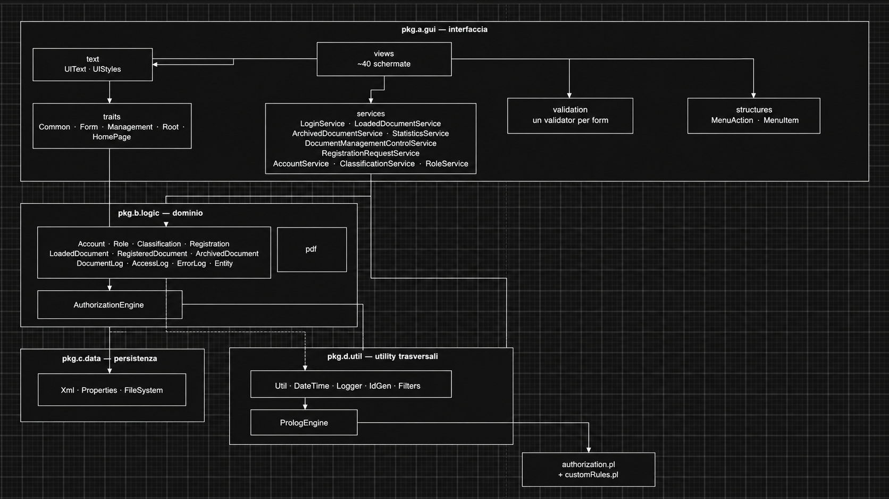
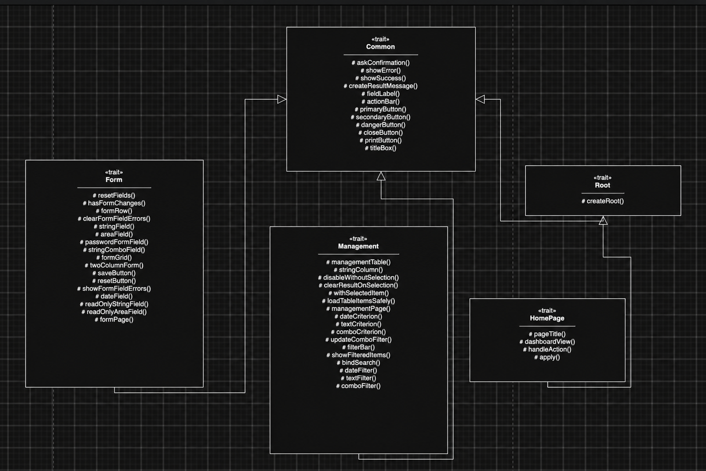
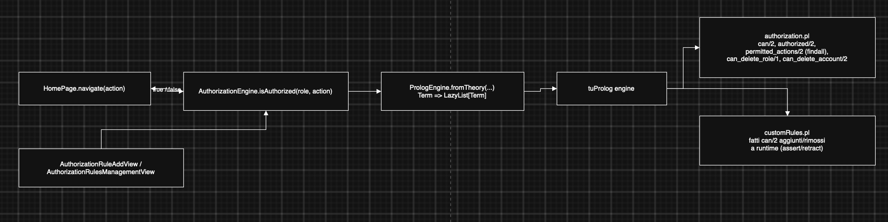

[Back to index](0-Indice.md) |
[Previous Chapter](2-Requirement_specification.md) |
[Next Chapter](4-Design_di_dettaglio.md)

# 3. Design architetturale

## 3.1 Stile architetturale

Il sistema è organizzato in quattro package, con un flusso di dipendenze a strati: l'interfaccia dipende dalla logica di dominio, la logica di dominio dipende dalla persistenza e dalle utility, mai il contrario. Non è un'architettura esagonale/a porte-e-adattatori formale — per la scala del progetto non se n'è vista la necessità — ma il principio di separazione tra "cosa fa l'applicazione" e "come sono salvati i dati" è rispettato ovunque tramite il contratto `Entity` (si veda 2.2).

Ogni entità implementa `Entity` (2.2) ed eredita gratuitamente CRUD su XML; le view non toccano mai direttamente `scala.xml` o il filesystem, passando sempre dai metodi dell'entità o da un service quando la logica coinvolge più entità (es. `LoadedDocumentService` che sposta un documento da "preso in carico" a "protocollato"). Questa scelta ha un costo: senza un vero livello di accesso ai dati, alcune regole di business (unicità username, invariante "ultimo amministratore") vivono nei `validator`/`service` invece che nell'entità stessa — una separazione meno netta di quella che un DBMS relazionale con vincoli avrebbe imposto, coerente con lo scostamento già discusso in 2.5.

## 3.2 Infrastruttura delle view

Le quasi 40 schermate dell'applicazione non duplicano codice di layout: condividono un albero di trait, ciascuno responsabile di un aspetto trasversale (dialoghi di conferma, messaggi di risultato, stile).

Le tre view di homepage (una per ruolo) non duplicano più, ciascuna, la costruzione del menu: `HomePage` calcola gli item visibili chiamando `AuthorizationEngine.permittedActions(role)` una sola volta, e ogni sottoclasse implementa solo `dashboardView` (il contenuto della pagina iniziale) e `handleAction` (cosa fare quando una voce di menu viene selezionata). Il punto architetturalmente rilevante è `HomePage.navigate`: **ogni azione richiesta dal menu passa da un unico varco**, che verifica `AuthorizationEngine.isAuthorized(currentAccount.getRole, action)` prima di eseguire `handleAction`. Non esistono altri punti in cui un'azione di menu viene eseguita: un ruolo non autorizzato non vede la voce nel proprio menu (perché non compare tra i `permittedActions`), e anche riuscendo a invocarla altrimenti verrebbe comunque bloccato da questo controllo. È una forma minima di *defense in depth*, applicata qui perché il requisito obbligatorio della proposta di progetto chiedeva esplicitamente una verifica delle autorizzazioni tramite regole logiche (si veda 3.3), non per un requisito di sicurezza avanzata a sé stante.

## 3.3 Il motore di autorizzazione Prolog

Il requisito "utilizzo di regole logiche per la verifica delle autorizzazioni" è implementato isolando **tutta** la logica di autorizzazione in una teoria Prolog, interrogata da un unico punto di accesso Scala (`AuthorizationEngine`), a sua volta l'unico file che importa `alice.tuprolog.*` oltre al motore stesso (`PrologEngine`).

Alcune scelte di implementazione, rilevanti a livello architetturale:

- **encapsulation pattern**: `PrologEngine.fromTheory` restituisce `Term => LazyList[Term]`, non espone mai l'engine tuProlog né i suoi tipi al resto dell'applicazione — pattern ripreso direttamente dal materiale del corso (Scala2P);
- **teoria base immutabile, regole personalizzate separate**: `authorization.pl` (nel classpath, parte del jar) non viene mai riscritto; le regole aggiunte da un amministratore tramite la GUI (`AuthorizationRuleAddView`) vengono `assert`ate nell'engine live e persistite in un secondo file, `customRules.pl`, caricato in append alla teoria base a ogni avvio — così un aggiornamento dell'app non cancella le personalizzazioni fatte da un cliente;
- **menu dinamico**: le voci di menu di ogni ruolo non sono cablate nel codice Scala, ma calcolate da `permitted_actions/2`, un predicato Prolog che usa `findall` per raccogliere tutte le azioni permesse a un ruolo — aggiungere una regola `can(ruolo, azione)` (da codice o da GUI) fa comparire la voce nel menu senza ricompilare;
- **stessa infrastruttura per requisito obbligatorio e opzionale**: la personalizzazione delle regole via GUI (opzionale, si veda 7) riusa lo stesso `AuthorizationEngine` del controllo obbligatorio, non un sistema parallelo.

Il motore di autorizzazione resta l'unico punto del progetto in cui la programmazione logica sostituisce codice imperativo che sarebbe stato altrettanto semplice da scrivere in Scala; una riflessione onesta su quanto questo abbia effettivamente semplificato il codice è in sezione 7.

## 3.4 Riepilogo delle scelte architetturali

| Aspetto | Scelta | Motivazione |
|---|---|---|
| Stile complessivo | Layered (GUI → dominio → persistenza/utility) | Semplicità, adeguata alla scala del progetto |
| Composizione GUI | Trait condivisi (`Common`/`Form`/`Management`/`Root`/`HomePage`) | Elimina la duplicazione tra ~40 view |
| Punto di controllo autorizzazioni | Unico (`HomePage.navigate`) | Un solo posto da verificare/testare per l'invariante "azione non autorizzata mai eseguita" |
| Regole di autorizzazione | Prolog (tuProlog), incapsulato da `PrologEngine`/`AuthorizationEngine` | Requisito obbligatorio della proposta di progetto |
| Persistenza | File XML, uno per entità | Vincolo/indicazione della proposta di progetto; scostamento dal POS originale (si veda 2.5) |
| Regole di business (unicità, invarianti) | Nei `validator`/`service`, non nell'entità | Compensa l'assenza di vincoli di un DBMS relazionale |

[Back to index](0-Indice.md) |
[Previous Chapter](2-Requirement_specification.md) |
[Next Chapter](4-Design_di_dettaglio.md)