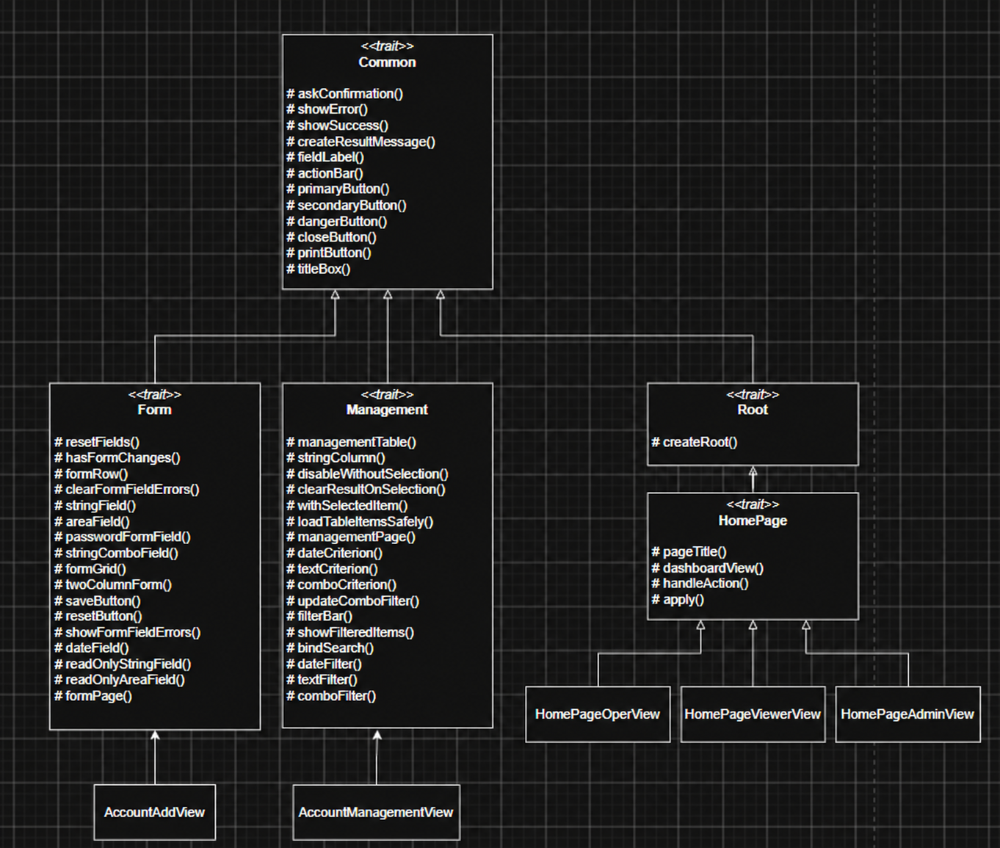
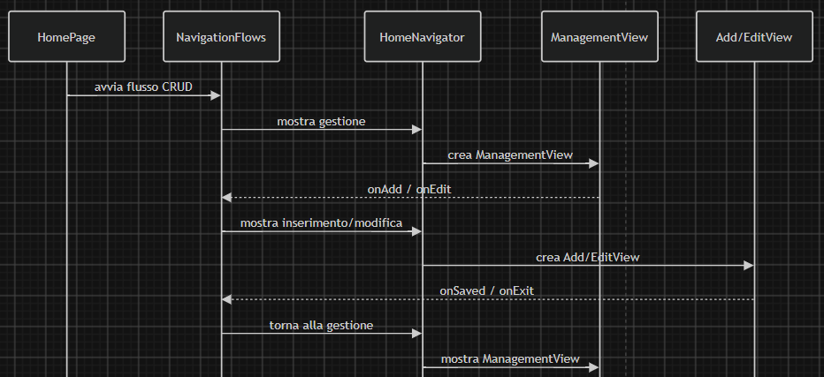
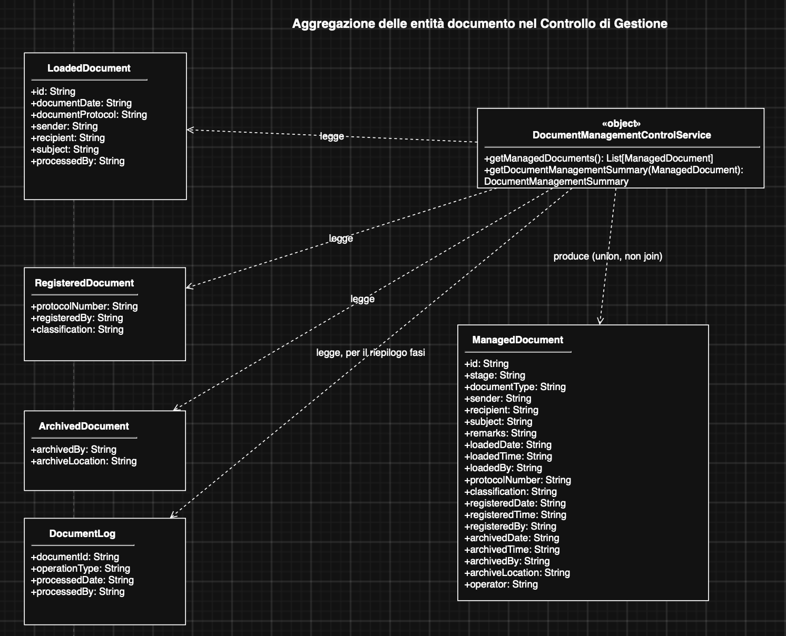
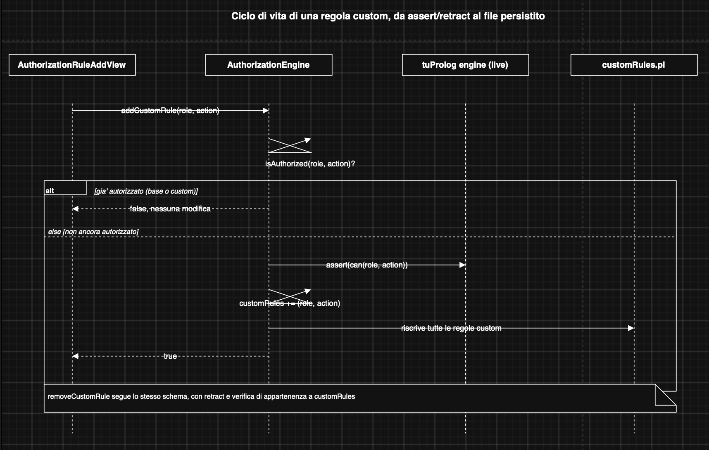
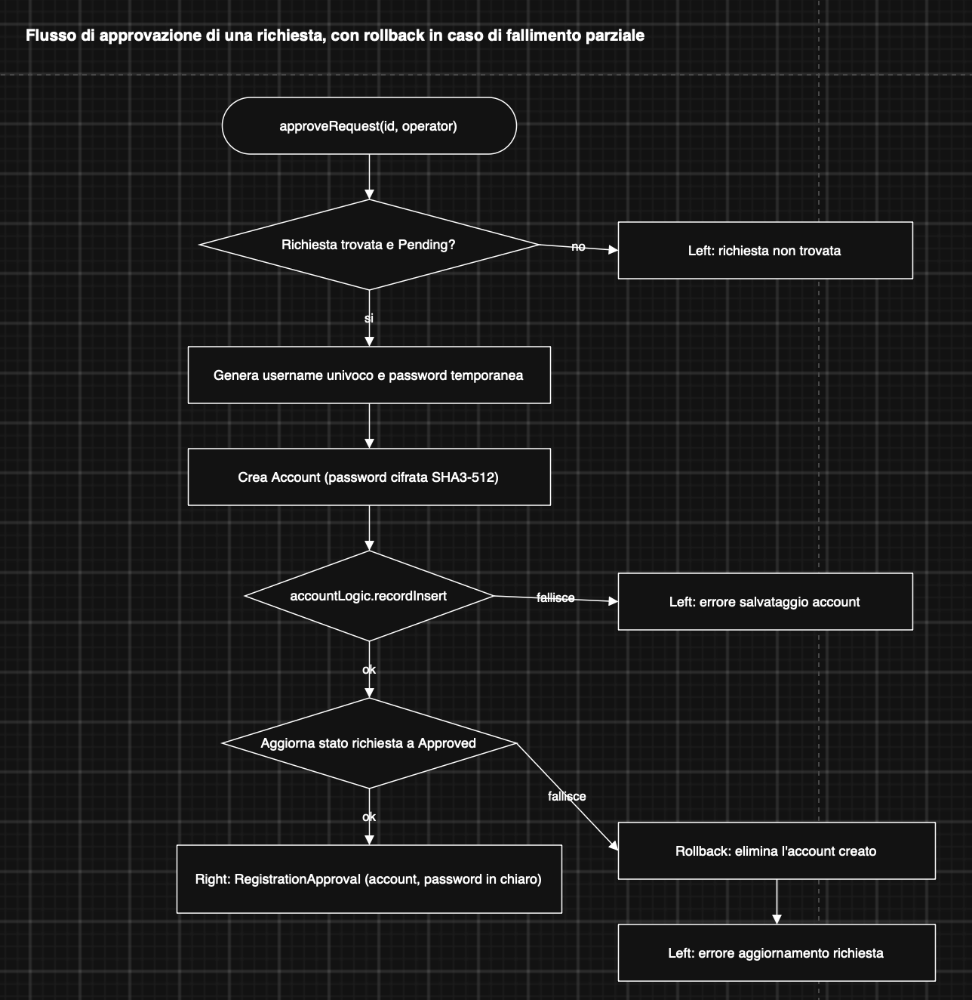

[Back to index](0-Indice.md) |
[Previous Chapter](3-Design_architetturale.md) |
[Next Chapter](5-Implementazione.md)
# 4. Design di dettaglio

Questa sezione descrive le principali scelte di design adottate 
nell'implementazione dei diversi sottosistemi di ProtoFlow.

A differenza del design architetturale, che descrive la struttura
generale del sistema e le responsabilità dei principali package,
il design di dettaglio approfondisce l'organizzazione interna dei
componenti, le loro responsabilità e le collaborazioni tra le
principali astrazioni introdotte durante lo sviluppo.

La sezione è suddivisa in base alle principali aree sviluppate dai
membri del gruppo.

## 4.1 Interfaccia grafica e navigazione — Roberto Pisu
Questa sezione descrive la struttura dell'interfaccia grafica di ProtoFlow, concentrandosi in particolare sulla gestione della navigazione e sull'organizzazione delle schermate.

Molte viste dell'applicazione condividono elementi e comportamenti simili, come la struttura dei moduli d'inserimento dati (form), le schermate di gestione e le home page dedicate ai vari ruoli utente.

Per evitare di duplicare il codice e mantenere il progetto pulito, queste parti comuni sono state raggruppate in componenti riutilizzabili tramite trait, lasciando a moduli specifici il compito di gestire il passaggio da una schermata all'altra.

### 4.1.1 Astrazioni comuni dell'interfaccia grafica

Le diverse schermate dell'applicazione condividono numerosi elementi
grafici e comportamentali. Una loro implementazione indipendente avrebbe
portato alla duplicazione della stessa logica all'interno delle singole
view.

Per questo motivo sono state definite alcune astrazioni comuni tramite
trait Scala. Ogni trait raccoglie funzionalità appartenenti allo stesso
livello di responsabilità, mentre le view concrete mantengono solamente
la configurazione e il comportamento specifico della schermata.

In particolare, `Common` raccoglie i costruttori e i comportamenti
grafici più generali. A partire da questa base, `Form` e `Management`
specializzano rispettivamente la costruzione dei moduli e delle
schermate di gestione, mentre `Root` definisce la struttura generale
dell'interfaccia dell'applicazione. `HomePage`, infine, estende tale
struttura introducendo il comportamento comune alle homepage dei
diversi ruoli.

La struttura delle principali astrazioni condivise e il loro rapporto
con alcune view concrete prese come esempio è rappresentata nel seguente diagramma.

### 4.1.2 Struttura della navigazione tra le view

La navigazione è organizzata su più livelli, in modo da separare
responsabilità differenti.

`AppNavigator` gestisce le transizioni principali dell'applicazione,
ovvero quelle che comportano la sostituzione dell'intera scena:
accesso, registrazione e apertura della homepage associata all'utente
autenticato.

All'interno della homepage la navigazione viene invece delegata a
`HomeNavigator`. Quest'ultimo mantiene il riferimento all'area centrale
dell'interfaccia e permette di sostituirne il contenuto senza che le
singole view debbano conoscere la struttura complessiva della pagina.

I flussi di navigazione che ricorrono in più funzionalità sono stati
ulteriormente estratti nell'oggetto `NavigationFlows`. In particolare
sono stati individuati tre schemi principali:

- gestione → inserimento/modifica → gestione;
- gestione → inserimento → gestione;
- gestione → dettaglio/elaborazione → gestione.

Le funzioni `showCrud`, `showCreateFlow` e `showSelectionFlow`
rappresentano tali schemi in maniera parametrica, ricevendo come
argomenti le factory delle view coinvolte. In questo modo le homepage
specifiche dei diversi ruoli devono solamente associare una voce di
menu al flusso e alle view concrete da utilizzare.

Le relazioni tra le view vengono quindi espresse attraverso funzioni
di callback, come `onSaved`, `onExit`, `onEdit` e `onView`, anziché
tramite riferimenti diretti tra le schermate. Questo riduce
l'accoppiamento tra le view e permette di riutilizzare la stessa
schermata all'interno di flussi differenti.

Il seguente diagramma di sequenza mostra un'applicazione concreta di
questo meccanismo nel flusso CRUD relativo alla gestione degli account.
La homepage avvia il flusso tramite `NavigationFlows`, mentre
`HomeNavigator` si occupa della sostituzione della view corrente.
Le operazioni di inserimento e modifica ritornano alla schermata di
gestione attraverso le callback ricevute dalle rispettive view.

### 4.1.3 Gestione dei form e dello stato dei campi

Un'altra famiglia di schermate fortemente ricorrente è costituita dai
moduli utilizzati per inserire, modificare o visualizzare informazioni.

Per evitare che ogni view gestisse autonomamente costruzione dei
controlli, errori di validazione, reset e rilevamento delle modifiche,
tale comportamento è stato raccolto nel trait `Form`.

L'astrazione principale introdotta è `FormField`, che incapsula un
controllo ScalaFX insieme alle operazioni necessarie per gestirne lo
stato. Ogni campo conserva il proprio valore iniziale e le funzioni
utilizzate per leggere e scrivere il valore del controllo.

Questa rappresentazione permette di trattare uniformemente controlli
grafici differenti. Campi testuali, password, `ComboBox`, `DatePicker`
e aree di testo possono quindi essere sottoposti alle stesse operazioni
di reset, rilevamento delle modifiche e visualizzazione degli errori.

Le singole view non costruiscono direttamente tutta la struttura del
form, ma utilizzano i costruttori messi a disposizione dal trait,
come `stringField`, `stringComboField`, `dateField` e le rispettive
varianti read-only. I campi vengono successivamente organizzati in
`FormRow` e composti attraverso `formGrid` o `twoColumnForm`.

Infine, `formPage` definisce la struttura comune della schermata,
componendo intestazione, contenuto, messaggi di feedback e barra delle
azioni. Le view concrete mantengono quindi solamente la definizione
dei campi richiesti e la logica specifica dell'operazione.

La stessa struttura viene utilizzata, ad esempio, nelle schermate di
inserimento e modifica di account, ruoli e classifiche e nelle
schermate di dettaglio dei documenti.

### 4.1.4 Gestione uniforme di tabelle, selezione e filtri

Le schermate dedicate alla gestione di collezioni di elementi
presentano una struttura ricorrente composta da una tabella, eventuali
strumenti di ricerca e un insieme di azioni applicabili all'elemento
selezionato.

Il trait `Management` raccoglie il comportamento comune a questa
famiglia di view.

La tabella viene costruita attraverso `managementTable`, mentre le
colonne vengono definite separatamente tramite funzioni parametrizzate
rispetto al tipo degli elementi visualizzati. Le view concrete possono
quindi descrivere le proprie colonne specificando solamente la funzione
utilizzata per ottenere il valore da mostrare.

Anche la gestione della selezione è stata centralizzata. Operazioni
come modifica, eliminazione o visualizzazione vengono abilitate solamente
quando è presente un elemento selezionato e l'accesso all'elemento
avviene attraverso `withSelectedItem`. In questo modo il controllo
della selezione non viene ripetuto all'interno di ogni azione.

Lo stesso principio è stato applicato alla ricerca. I diversi controlli
grafici vengono trasformati in criteri di filtro attraverso funzioni
come `textCriterion`, `dateCriterion` e `comboCriterion`.
L'associazione dei filtri alla ricerca è realizzata tramite
`bindSearch`, che permette di aggiornare automaticamente i risultati
quando il valore di un filtro viene modificato.

Le view concrete rimangono responsabili della scelta dei campi sui quali
effettuare la ricerca, mentre la gestione dei controlli, della selezione
e dell'aggiornamento della tabella rimane condivisa.

Questa organizzazione è utilizzata, tra le altre, nelle schermate di
gestione degli account, dei ruoli, delle classifiche, dei documenti
archiviati e dei log.

### 4.1.5 Controllo delle modifiche non salvate

La separazione tra view e navigazione introduce il problema di impedire
la perdita accidentale delle modifiche effettuate all'interno di un form.

Per mantenere questo controllo indipendente dalla specifica schermata,
le view costruite tramite `Form` espongono al sistema di navigazione una
funzione che permette di verificare la presenza di modifiche non
salvate.

Il controllo viene calcolato confrontando il valore corrente dei
`FormField` con il relativo valore iniziale. Prima di sostituire la view
corrente, `HomeNavigator` verifica tale informazione e, quando
necessario, richiede conferma all'utente.

In questo modo il navigator non deve conoscere i campi contenuti nella
view e, allo stesso tempo, la view non deve conoscere quale schermata
verrà aperta successivamente. La collaborazione avviene quindi
attraverso un contratto minimale basato sulla funzione
`hasUnsavedChanges`.

### 4.1.6 Separazione della validazione dalla rappresentazione grafica

La validazione dei dati inseriti dall'utente è stata mantenuta separata
dalla costruzione dell'interfaccia grafica.

Per le principali entità sono stati introdotti componenti dedicati,
come `AccountValidator`, `RoleValidator`,
`ClassificationValidator` e `RegistrationValidator`, che ricevono i
dati da verificare e restituiscono l'insieme degli errori rilevati.

Le view utilizzano quindi il validator appropriato e si occupano
solamente di associare gli errori ricevuti ai corrispondenti
`FormField`. La visualizzazione dell'errore rimane responsabilità del
trait `Form`, mentre le regole che stabiliscono se un valore è valido
rimangono indipendenti dalla tecnologia grafica.

Questa separazione riduce la quantità di logica applicativa contenuta
nelle view e rende le regole di validazione verificabili
indipendentemente dall'interfaccia.

## 4.2 Controllo di gestione, autorizzazione Prolog e registrazioni — Thomas Testa

Questa sezione approfondisce tre punti del sistema che, a differenza delle astrazioni condivise descritte in 4.1, non riguardano l'infrastruttura comune ma la logica applicativa di specifici sottosistemi: l'aggregazione dei documenti nel Controllo di Gestione, il ciclo di vita delle regole di autorizzazione personalizzate, e il flusso di approvazione di una richiesta di registrazione.

### 4.2.1 Aggregazione dei documenti nel Controllo di Gestione

Il ciclo di vita di un documento attraversa tre entità indipendenti — `LoadedDocument`, `RegisteredDocument`, `ArchivedDocument` — ciascuna persistita nel proprio file XML e non collegata alle altre da ereditarietà (si veda anche 2.2). `DocumentManagementControlService` costruisce da queste tre collezioni, più `DocumentLog` per lo storico delle fasi, un'unica vista di dominio, `ManagedDocument`, usata dalla GUI per mostrare lo stato di lavorazione indipendentemente dallo stadio raggiunto.

L'aggregazione non è un vero join: ogni record delle tre collezioni viene mappato indipendentemente in un `ManagedDocument` (tramite tre overload di `toManagedDocument`, uno per tipo sorgente) e i risultati vengono concatenati e ordinati per id. Questo è corretto, e non richiede una logica di deduplica, perché è garantito un invariante a monte: quando un documento avanza di stadio, il record dello stadio precedente viene eliminato (`LoadedDocumentService`/`ArchivedDocumentService`), quindi un dato id esiste sempre in una sola delle tre collezioni alla volta.

### 4.2.2 Ciclo di vita delle regole di autorizzazione personalizzate

Il requisito opzionale di personalizzazione delle regole organizzative estende il motore di autorizzazione Prolog descritto in 3.3 con la possibilità, per un amministratore, di aggiungere o rimuovere regole `can(ruolo, azione)` a runtime dalla GUI (`AuthorizationRuleAddView`, `AuthorizationRulesManagementView`).

`AuthorizationEngine.addCustomRule` verifica prima `isAuthorized(role, action)` sull'engine live (teoria base più regole già personalizzate): se il permesso esiste già, non viene asserito nulla. Questo controllo evita che una regola "personalizzata" duplichi un fatto `can/2` già presente nella teoria base — nel qual caso `permitted_actions/2`, essendo implementato con `findall`, restituirebbe la stessa azione due volte nella lista usata per costruire il menu. Solo se il ruolo non è già autorizzato la regola viene asserita nel motore (`assert`) e la nuova coppia viene aggiunta a un insieme in memoria (`mutable.LinkedHashSet`, che garantisce sia l'unicità sia l'ordine di inserimento), che viene poi interamente riscritto su `customRules.pl`. `removeCustomRule` segue lo schema simmetrico con `retract`, verificando però l'appartenenza della regola a `customRules` prima di procedere: una regola della teoria base non può quindi mai essere rimossa passando per questo percorso, perché semplicemente non vi è mai stata tracciata.

### 4.2.3 Approvazione di una richiesta di registrazione

`RegistrationRequestService.approveRequest` coordina la trasformazione di una richiesta di registrazione pendente in un account applicativo: genera uno username univoco (con suffisso numerico incrementale in caso di collisione) e una password temporanea, crea l'`Account` con la password cifrata (SHA3-512), e solo in caso di inserimento riuscito aggiorna lo stato della richiesta a `Approved`.

Poiché l'account e la richiesta sono persistiti in due file XML indipendenti, non esiste una transazione atomica che copra entrambe le scritture. Se l'inserimento dell'account riesce ma l'aggiornamento della richiesta fallisce, il servizio esegue un rollback esplicito cancellando l'account appena creato, in modo da non lasciare nel sistema un account "orfano" non riconducibile ad alcuna richiesta approvata. La password in chiaro non viene mai persistita: esiste solo nel valore di ritorno (`RegistrationApproval`), usato per mostrarla una tantum all'operatore che dovrà comunicarla al nuovo utente.
[Back to index](0-Indice.md) |
[Previous Chapter](3-Design_architetturale.md) |
[Next Chapter](5-Implementazione.md)